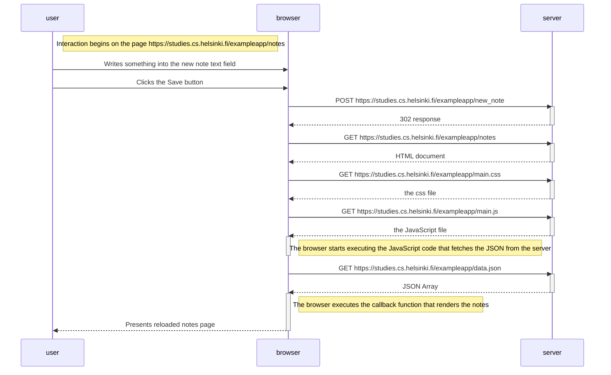

```mermaid
sequenceDiagram
    participant user
    participant browser
    participant server

    Note right of user: Interaction begins on the page https://studies.cs.helsinki.fi/exampleapp/notes

    user->>browser: Writes something into the new note text field
    user->>browser: Clicks the Save button
    browser->>server: POST https://studies.cs.helsinki.fi/exampleapp/new_note
    activate server
    server-->>browser: 302 response
    deactivate server

    browser->>server: GET https://studies.cs.helsinki.fi/exampleapp/notes
    activate server
    server-->>browser: HTML document
    deactivate server

    browser->>server: GET https://studies.cs.helsinki.fi/exampleapp/main.css
    activate server
    server-->>browser: the css file
    deactivate server

    browser->>server: GET https://studies.cs.helsinki.fi/exampleapp/main.js
    activate server
    server-->>browser: the JavaScript file
    deactivate server


    activate browser
    Note right of browser: The browser starts executing the JavaScript code that fetches the JSON from the server
    deactivate browser

    browser->>server: GET https://studies.cs.helsinki.fi/exampleapp/data.json
    activate server
    server-->>browser: JSON Array
    deactivate server

    activate browser
    Note right of browser: The browser executes the callback function that renders the notes

    browser-->>user: Presents reloaded notes page
    deactivate browser
```
