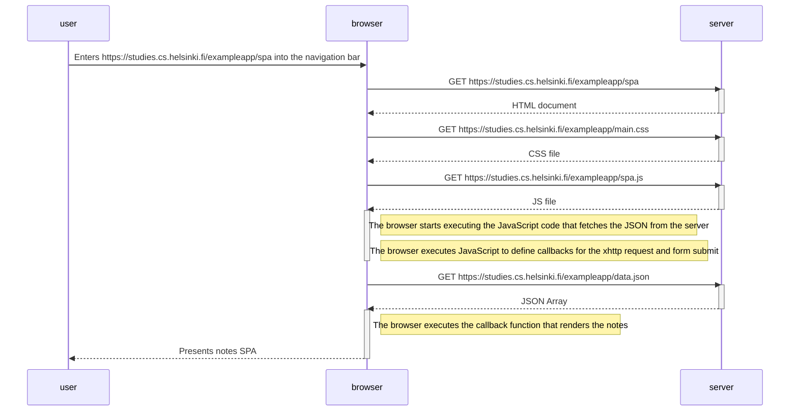

```mermaid
sequenceDiagram
    participant user
    participant browser
    participant server

    user->>browser: Enters https://studies.cs.helsinki.fi/exampleapp/spa into the navigation bar
    browser->>server: GET https://studies.cs.helsinki.fi/exampleapp/spa
    activate server
    server-->>browser: HTML document
    deactivate server

    browser->>server: GET https://studies.cs.helsinki.fi/exampleapp/main.css
    activate server
    server-->>browser: CSS file
    deactivate server

    browser->>server: GET https://studies.cs.helsinki.fi/exampleapp/spa.js
    activate server
    server-->>browser: JS file
    deactivate server

    activate browser
    Note right of browser: The browser starts executing the JavaScript code that fetches the JSON from the server
    Note right of browser: The browser executes JavaScript to define callbacks for the xhttp request and form submit
    deactivate browser

    browser->>server: GET https://studies.cs.helsinki.fi/exampleapp/data.json
    activate server
    server-->>browser: JSON Array
    deactivate server

    activate browser
    Note right of browser: The browser executes the callback function that renders the notes

    browser-->>user: Presents notes SPA
    deactivate browser
```
