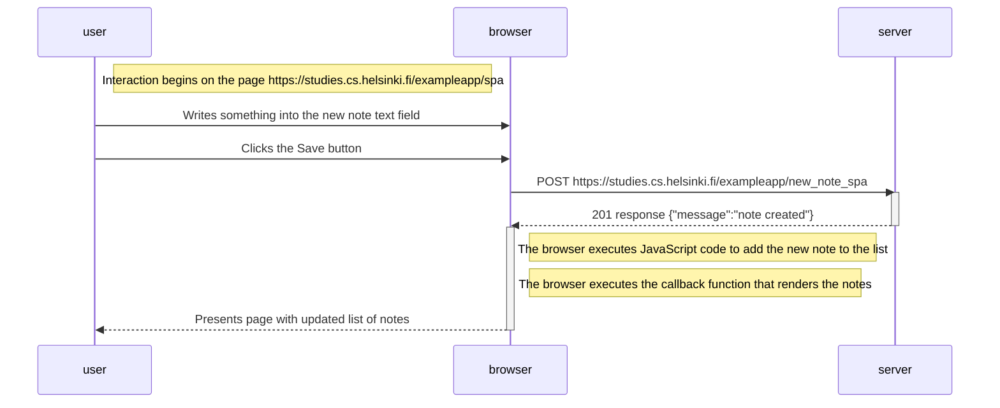

```mermaid
sequenceDiagram
    participant user
    participant browser
    participant server

    Note right of user: Interaction begins on the page https://studies.cs.helsinki.fi/exampleapp/spa

    user->>browser: Writes something into the new note text field
    user->>browser: Clicks the Save button
    browser->>server: POST https://studies.cs.helsinki.fi/exampleapp/new_note_spa
    activate server
    server-->>browser: 201 response {"message":"note created"}
    deactivate server

    activate browser
    Note right of browser: The browser executes JavaScript code to add the new note to the list
    Note right of browser: The browser executes the callback function that renders the notes

    browser-->>user: Presents page with updated list of notes
    deactivate browser
```
